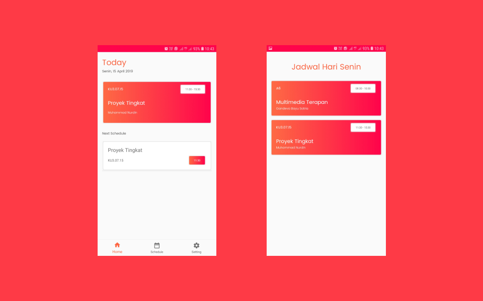

# zeitplan
Aplikasi Pengingat Jadwal Kuliah Berbasis Android Java SQlite (Proyek Tingkat 2 Semester 4)

# zeitplan version-1
changelog :
- Using content resolver
- Notification working with service but sometimes popup lately
- Using BottomNavigation + Fragment

# zeitplan version-2.0
changelog :
- Add fragment jadwal and schedule activity
- Add function button enable if exist day

# zeitplan version-2.1
changelog : 
- Add query see all schedule based day
- Fixing bug (force close if add data but not complete)

# zeitplan version-2.2
changelog :
- Fixing application concept (Add schedule in schedule fragment)
- Only display today schedule in main fragment
- See all schedule in schedule fragment
- Add and update schedule in schedule fragment

# zeitplan version-2.3
changelog :
- Add waktu_selesai in zeitplan table
- Add function upcomming schedule

# zeitplan version-2.4
changelog :
- Add fragment setting
- Add function turn on/off notification
- Add intent contact and feedback

# zeitplan version-2.5
changelog :
- add function delete all schedule
- add animation intent

# zeitplan version-2.6
changelog :
- fixing languange
- fixing backButton in toolbar
- fixing validation insert data
- add toolbar in schedule activity

# Screenshot :

